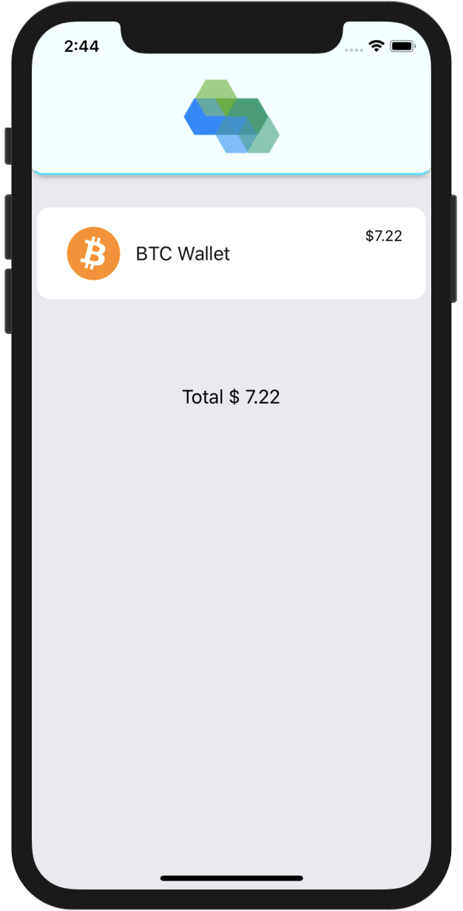
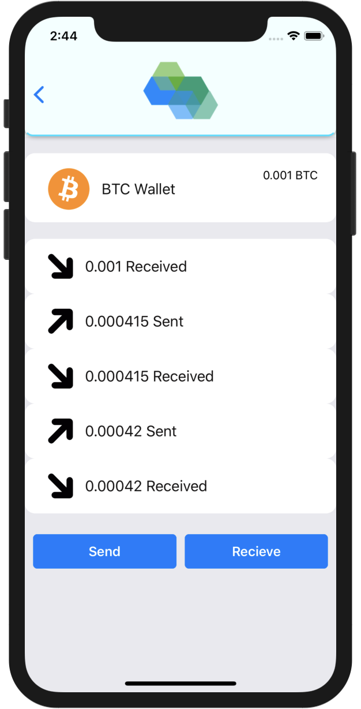

# Onyx
### React-Native Bitcoin Wallet

Built with React-Native and Redux persist

Send and receive BTC easily and securely while have full custody of your private keys!

&nbsp;&nbsp;&nbsp;&nbsp;
&nbsp;&nbsp;&nbsp;&nbsp;

#### Disclaimer
- Use with small amounts of BTC. Project still under Development
- Fees are set extremely low so expect long confirmation time (0.0002 BTC)

### Running locally
- Make sure you have react-native installed. Use `npm install -g react-native-cli`
- As well as xcode for ios or android studio for android
- Install project dependencies using `npm install` 
- run `react-native run-ios` or `react-native run-android` respectively

BTC Donations: 1FSdT1xrXrkksnvjGzkhj7hkQAqzAqqm8P
